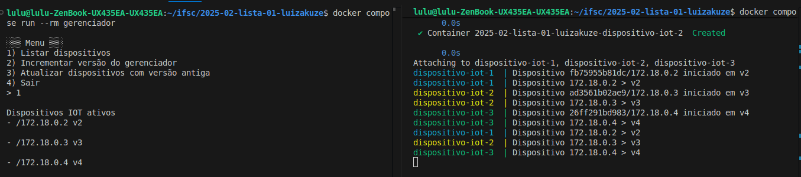
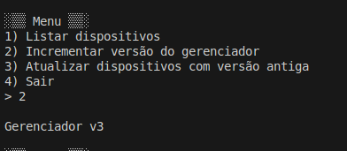
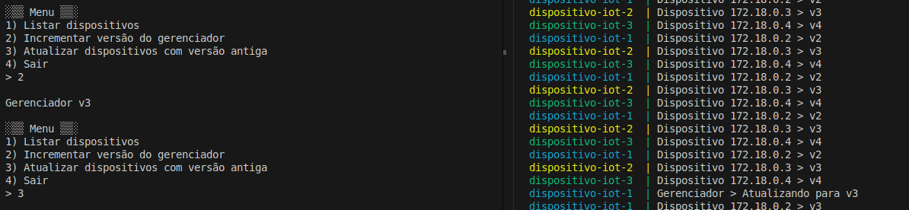
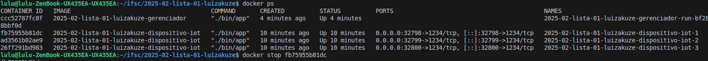
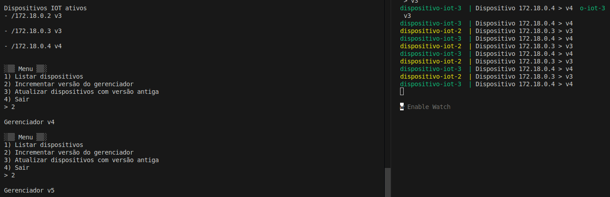
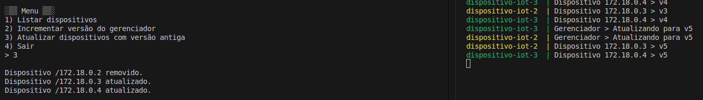

# Prática com contêineres e sockets TCP/IP em Java

## Funcionalidades obrigatórias 
- Todos as funcionalidades do exercício foram atendidas.

## Funcionalidades adicionais
Além dos requisitos da atividade, foram adotados os seguintes comportamentos:
- Se um dispositivo IoT possuir uma versão superior à do gerenciador (ex.: foi iniciada via argumento
`java -jar dispositivo-IoT.jar 7`), ele não será atualizado, pois já está mais recente.
- Caso o usuário não informe uma versão inicial ao iniciar o dispositivo IoT,
a aplicação utiliza o último octeto do IP do dispositivo.

## Execução do cenário de teste
O cenário foi montado com 3 dispositivos IoT e 1 gerenciador.

Clonar o projeto e acessar o diretório raíz:
```bash
git clone https://github.com/STD29006-classroom/2025-02-lista-01-luizakuze
cd 2025-02-lista-01-luizakuze
```

Executar os comandos abaixo:
```bash
# Construir as imagens
docker compose build
# Iniciar os 3 dispositivos com versões aleatórias 
docker compose up --scale dispositivo-iot=3 dispositivo-iot
# Em outro terminal, iniciar a interação com o gerenciador
docker compose run --rm gerenciador
```

## Demonstração

### Lista de dispositivos IoT conectados
O gerenciador mantém uma lista atualizada dos dispositivos ativos de acordo com as mensagens via Multicast.




### Incrementando a versão do gerenciador
O gerenciador inicia em `v1`. A cada ação, a versão é incrementada:

> Exemplo: incrementado 2 vezes e está em `v3`




### Atualizando dispositivos IoT

Existem alguns cenários possíveis durante a atualização:

| Versão do dispositivo IoT | Comparação com gerenciador | Ação tomada |
|---------------------------|---------------------------|--------------|
| >= versão do gerenciador | Atualizado        | Não atualiza |
| < versão do gerenciador e ativo | Desatualizado | Atualiza via TCP |
| < versão do gerenciador e inativo | Desatualizado |  Remove da lista |

Exemplo: o gerenciador está em `v3`, e entre os dispositivos, apenas o `v2` foi atualizado para `v3`.



> Note que o gerenciador enviou atualização *apenas para o dispositivo conectado via TCP e ativo* (à direita).


### Remoção de dispositivo IoT inativo

Se um dispositivo é parado (contêiner encerrado), o gerenciador ainda tenta a atualização via TCP.
Não obtendo resposta, **o dispositivo é automaticamente removido** da lista.

Primeiro parando o contêiner:


O cenário atual é: gerenciador em `v5`, apenas dois dispositivos continuam ativos.



Resultado após tentar atualizar todos:



> O dispositivo desconectado não respondeu e foi corretamente removido.